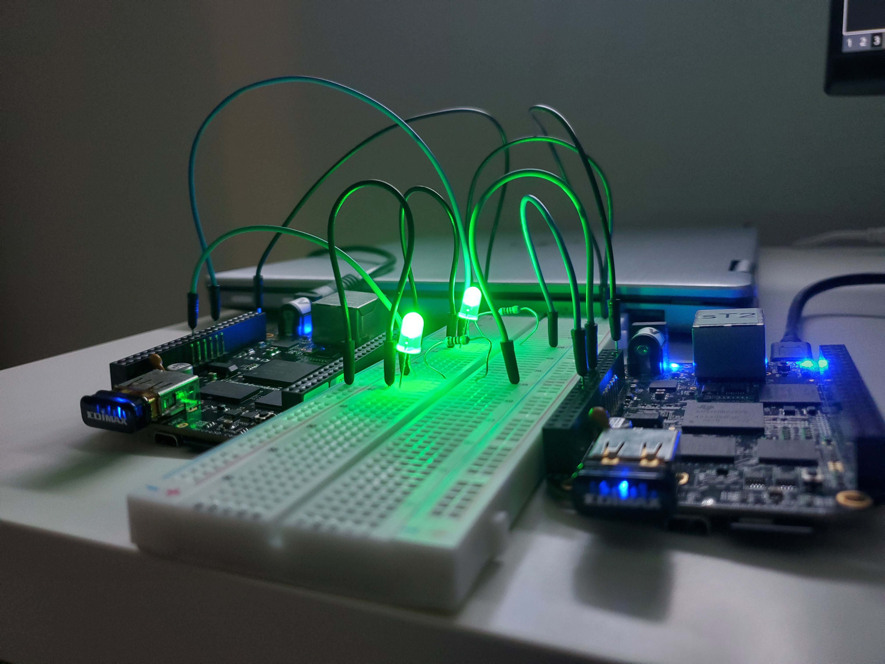
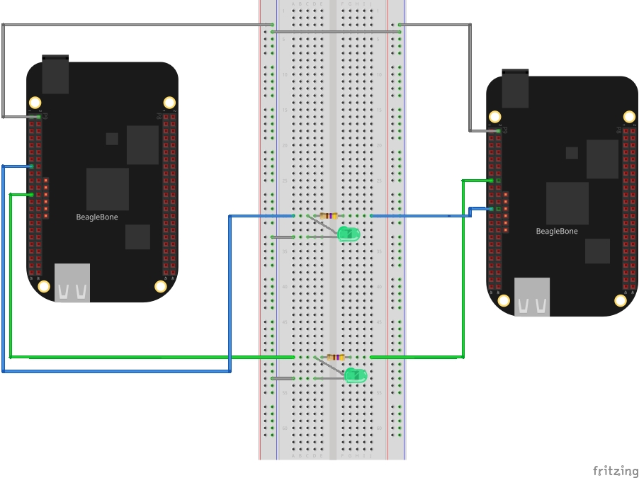

# GPIO Driven Synchronization

<p align="center">
  
</p>

This project implements an application that synchronizes two machines using GPIO
signals. This README describes how to configure the hardware and software in
order to run `gsync`. For a more in depth discussion of the project, check out
the [GPIO Driven Synchronization][1] blog post. For project documentation, see
the section [Building the Docs and More](#building-the-docs-and-more).

### Hardware Setup

You can run `gsync` on any single board computer supporting Linux. We used two
[BeagleBone Black][1] (BBB) computers as our test platform. The rest of this
guide will assume you are using two BBBs. Below is a list of the hardware needed
to run `gsync`:

* 2x BeagleBone Black
* Breadboard
* Breadboard Jumper Wires
* 2x 470 Ohm Through-hole Resistors
* 2x LED (optional)
* Oscilliscope (optional)

Below is the wiring configuration used during testing.

<p align="center">
  
</p>

`P9_15` and `P9_23` are used as the GPIO TX/RX lines. **Be sure to cross the
GPIO lines as shown in the diagram**. `P9_2` is GND. If you choose to use
different GPIOs, consult the [header pin table][2] to ensure you pick
unallocated GPIOs that are muxed correctly!

### BeagleBone Black Configuration

To get the best synchronization results, you will want to configure your BBBs to
run the latest Linux kernel with the [`PREEMPT_RT`][3] patch applied. The
[bbb_kernel_builder][4] project can help you get up and running with a
`PREEMPT_RT` patched kernel. See my [Building and Deploying a Real-Time Kernel
to the BeagleBone Black][5] post for more info. For help and guidance in
configuring the kernel for real-time, check out the section on kernel
configuration in [Real-Time Linux App Development][6].

There's a good number of tweaks needed to make an application successfully run
in near real-time on a Linux system. The `gsync` source and launch scripts cover
most of the bases. You will however want to make one additional system level
tweak: disable `/proc/sys/kernel/sched_rt_runtime_us`. You can read about why
this configuration is important in the section on scheduling policies in
[Real-Time Linux App Development][6]. This setting needs to be configured after
every boot. To do so, we can write a systemd service as described below.

1. Create the service file
   `/etc/systemd/system/disable-sched-rt-runtime-us.service` with the following
   contents:
```
[Unit]
Description=Disable RT process runtime limiting

[Service]
ExecStart=/bin/sh -c "echo -1 > /proc/sys/kernel/sched_rt_runtime_us"

[Install]
WantedBy=multi-user.target
```
2. Enable the service so that it is active on boot:
```
systemctl enable disable-sched-rt-runtime-us
```
3. Either reboot the board or start the service directly using `systemctl`:
```
systemctl start disable-sched-rt-runtime-us
```

### Cross Compiling for BBB

`gsync` includes a [build script](scripts/build.sh) that supports multiple build
options. Run `build.sh -h` to see all the options. Unless you are building the
project directly on the BBB we, recommend following the containerized build
instructions outlined below to cross compile `gsync` for the BBB's armv7
architecture. To follow these instructions, you will need to install [Docker][7]
on your development PC.

1. Build the cross compilation image:
```
cd docker && docker build . -t gsync:latest
```
2. Run the [`continerized_build.sh`](scripts/containerized_build.sh) script to
   launch the container:
```
cd scripts/ && ./containerized_build.sh
```
3. From within the container shell, run the [`build.sh`](scripts/build.sh)
   project build script with the cross compilation flag set:
```
./build.sh -c
```
4. Verify the `gtimer` and `gsync` executables were installed on the host PC
   under `/path/to/gsync/bin/`.

### Deploying to the BBB

There are many ways to get files from a host PC to the BBB. The steps below
assume you will be moving the necessary binaries and scripts using SSH. To
deploy the project to BBB follow, these steps:

1. Copy the `gtimer` and `gsync` binaries from `bin` to a location on the BBB:
```
scp bin/* root@192.168.1.100:/root/
```
2. Copy the `run.sh` and `kill.sh` scripts to the same location on the BBB as in
   (1):
```
scp scripts/run.sh root@192.168.1.100:/root/
scp scripts/kill.sh root@192.168.1.100:/root/
```
3. Repeat steps (1) - (2) for BBB number 2.

### Running the Sync

Assuming you have followed the steps in all the preceding sections, kicking off
synchronization is as simple as executing the `run.sh` script previously
installed on **each** of the BBBs. To kill the application, run the `kill.sh`
script.

By default, `gsync` runs at a frequency of 1 Hz with a coupling constant of
`0.5`. In this configuration, you can verify the boards have synced when the
LEDs in the circuit flash in unison. If you want to run at higher frequencies or
tune the coupling constant, edit the `FREQ_HZ` and `COUPLING_CONST` variables in
the `run.sh` script. **Be sure all changes are applied to both boards!**

At higher frequencies, you will want to use an oscilliscope to measure the time
delay between the start of the `gsync` program on each board. Replacing the LEDs
with jumper wires connected to oscilliscope probes will allow you to take this
measurement.

### Building the Docs and More

This project uses [Doxygen][8] for source documentation. You can build the
project docs by running `build.sh -d`. HTML documentation will be output to
`docs/gsync`.

If you're interested in modifying the source, looking at the design artifacts
first might be helpful. Included in the [`docs/images`](docs/images) folder are
pictures of the circuit as well as diagrams showing the high level SW design and
`gtimer`/`gsync` state machines.

[1]: https://programmador.com/posts/gpio-driven-synchronization/
[2]: http://exploringbeaglebone.com/chapter6/#
[3]: https://wiki.linuxfoundation.org/realtime/preempt_rt_versions
[4]: https://github.com/ivan-guerra/bbb_kernel_builder
[5]: https://programmador.com/posts/building-and-deploying-a-real-time-kernel-to-the-beaglebone-black/
[6]: https://programmador.com/posts/real-time-linux-app-development/
[7]: https://www.docker.com/
[8]: https://www.doxygen.nl/index.html
